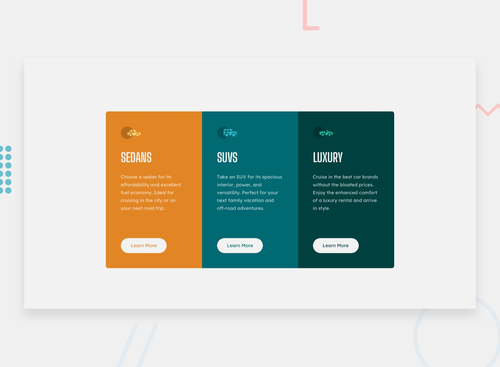

# Frontend Mentor - 3-column preview card component solution

This is a solution to the [3-column preview card component challenge on Frontend Mentor](https://www.frontendmentor.io/challenges/3column-preview-card-component-pH92eAR2-). Frontend Mentor challenges help you improve your coding skills by building realistic projects.

## Table of contents

- [Overview](#overview)
  - [The challenge](#the-challenge)
  - [Screenshot](#screenshot)
  - [Links](#links)
- [My process](#my-process)
  - [Built with](#built-with)
  - [What I learned](#what-i-learned)
  - [Continued development](#continued-development)
  - [Useful resources](#useful-resources)
- [Author](#author)

## Overview

### The challenge

Users should be able to:

- View the optimal layout depending on their device's screen size
- See hover states for interactive elements

### Screenshot

- Challenge Screenshot

### Links

- Solution URL: [Solution on Frontend Mentor](https://www.frontendmentor.io/solutions/3-column-preview-card-component-bcP6vODg5)
- Live Site URL: [Github page](https://mer7in.github.io/3-column-preview-card-component/)

## My process

### Built with

- Semantic HTML5 markup
- CSS custom properties
- Flexbox
- Mobile-first workflow

### What I learned

wtring less css is sometimes the better way to achieve what we want. This is a general rule. There are times when you want to use height, but for the most part, they cause more issues than they solve.

**Note: Delete this note and the content within this section and replace with your own learnings.**

### Continued development

Use this section to outline areas that you want to continue focusing on in future projects. These could be concepts you're still not completely comfortable with or techniques you found useful that you want to refine and perfect.

**Note: Delete this note and the content within this section and replace with your own plans for continued development.**

### Useful resources

- [Conquering responsive layouts](https://courses.kevinpowell.co/courses/conquering-responsive-layouts) - A good course to help you master responsive web design.

## Author

- Github - [@Mer7in](https://github.com/Mer7in)
- Frontend Mentor - [@Mer7in](https://www.frontendmentor.io/profile/Mer7in)

**Note: Delete this note and add/remove/edit lines above based on what links you'd like to share.**
